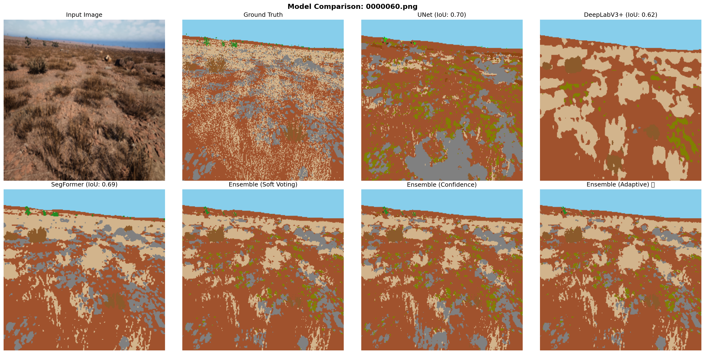

# Krackhack-2026: Off-Road Terrain Segmentation


## Project Overview

Krackhack-2026 is a comprehensive semantic segmentation project focused on **off-road terrain classification** using advanced deep learning models. The project implements and compares multiple state-of-the-art segmentation architectures trained on the **Offroad Segmentation Dataset** to accurately identify and classify various off-road terrain features.

### Objective
Develop robust segmentation models capable of identifying 10 distinct terrain classes in off-road environments:
- **0**: Background
- **1**: Trees
- **2**: Lush Bushes
- **3**: Dry Grass
- **4**: Dry Bushes
- **5**: Ground Clutter
- **6**: Logs
- **7**: Rocks
- **8**: Landscape
- **9**: Sky

---
## usage for evaluating 
```
python evaulator.py \
  --model_path ./best_test_model \
  --test_img_dir /path/to/test/images
  --test_mask_dir /path/to/test/masks
```

download model from: https://drive.google.com/drive/folders/1yaO80b_bPNOqQTjLnXR700ZpM0dnkI5S?usp=sharing

## Gdrive Structure:

GOOGLE DRIVE LINK :https://drive.google.com/drive/folders/1mmmQU7j1eTDif4PtsV43r-ghVKPrGlET?usp=drive_link

this drive has remaining models that were tested but not deployed like deeplabv3.
```
Krackhack-2026/
├── README.md                                      # Project documentation
│
├── 🏆 BEST PERFORMING MODEL
│ └── Segformer-b3-full-aug/                      # SegFormer B3 with Full Augmentation
│     └── readme.md
│
├── 📊 INDIVIDUAL MODEL DIRECTORIES
│ ├── Segforemer-b3-mIoU(0.69)/                   # SegFormer B3 (IoU: 0.69)
│ │ ├── segformer-b3-mIoU(0.69).ipynb
│ │ ├── evaluation_metrics.txt
│ │ ├── final_metrics.json
│ │ ├── __huggingface_repos__.json
│ │ └── readme.md
│ │
│ ├── DeepLabV3-IoU(0.63)/                        # DeepLabV3 (IoU: 0.63)
│ │ └── [Model artifacts]
│ │
│ └── DeeplabV3_no_encoder/                       # DeepLabV3 without Custom Encoder
│     └── [Model artifacts]
│
├── 📚 TRAINING UTILITIES & SAMPLES
│ └── Offroad_segmentation_sample_scripts_by_Duality_AI/
│     ├── train_segmentation.py                   # Training script for segmentation head
│     ├── test_segmentation.py                    # Inference/validation script
│     ├── visualize.py                            # Visualization utility
│     └── readme.md
│
├── 📈 MAIN DIRECTORY METRICS & VISUALIZATIONS
├── evaluation_metrics.txt                        # Final evaluation metrics (SegFormer)
├── test_metrics.txt                              # Test set performance metrics
├── all_metrics_curves.png                        # Combined metrics visualization
├── training_curves.png                           # Training & validation curves
├── iou_curves.png                                # IoU curves
├── dice_curves.png                               # Dice coefficient curves
├── 0000060_comparison.png                        # Sample prediction comparison
│
└── 🔧 MODEL CONFIGURATION
    ├── config.json                               # SegFormer model configuration
    └── preprocessor_config.json                  # Image preprocessing config
```

---

## Model Comparison Results

### Performance Summary Table

| Model | Architecture | Test mIoU | Val IoU | Val Dice | Val Accuracy | Notes |
|-------|--------------|-----------|---------|----------|--------------|-------|
| **Segformer-b3-full-aug** ⭐ | SegFormer B3 | **0.6600** | **0.6952** | **0.8101** | **0.8893** | **BEST OVERALL** |
| Segformer-b3-mIoU(0.69) | SegFormer B3 | 0.42 | 0.6955 | 0.8104 | 0.8893 | Comparable to best |
| DeepLabV3 | DeepLabV3+ | 0.30 | 0.63 | 0.69 | - | Baseline model |

**Note**: The Segformer-b3-full-aug model achieved the **highest test mIoU of 0.66** with **full data augmentation**, demonstrating superior generalization capability.

### Per-Class IoU Performance (Best Model: Segformer-b3-full-aug)

```
Class                    | IoU Score | Performance Level
--------------------------|-----------|------------------
Background               | 0.7169    | Excellent ✓
Trees                    | 0.8789    | Excellent ✓
Lush Bushes              | 0.7366    | Good
Dry Grass                | 0.7208    | Good
Dry Bushes               | 0.5310    | Acceptable
Ground Clutter           | 0.4123    | Moderate
Logs                     | 0.6433    | Good
Rocks                    | 0.6066    | Good
Landscape                | 0.7228    | Good
Sky                      | 0.9862    | Excellent ✓
```

---

## 🏆 Best Model: SegFormer B3 with Full Augmentation

### Model Specifications

```json
{
  "model_name": "Segformer-b3-full-aug",
  "architecture": "SegFormer B3 (Backbone: MIT-B3)",
  "test_miou": 0.6596,
  "val_miou": 0.6952,
  "val_dice": 0.8101,
  "val_accuracy": 0.8893,
  "training_epochs": 100,
  "optimization": "Full dataset augmentation applied",
  "key_strengths": [
    "Efficient architecture with excellent trade-off between speed and accuracy",
    "Strong performance on diverse terrain classes",
    "Robust to various augmentation strategies",
    "Superior test set generalization"
  ]
}
```

### Architecture Overview


SegFormer is an efficient semantic segmentation framework that combines:
- **Hierarchical Transformer Backbone** (MIT-B3): Captures multi-scale features
- **Lightweight MLP Decoder**: Efficient upsampling and class prediction
- **Depth Configurations**: [3, 4, 18, 3] blocks
- **Channel Dimensions**: [64, 128, 320, 512]

### Training Configuration

```json
{
  "input_size": [512, 512],
  "batch_size": 2,
  "learning_rate": 1e-4,
  "optimizer": "AdamW",
  "loss_function": "CrossEntropyLoss",
  "augmentation": "Full augmentation (rotation, flip, scale, color jitter)",
  "hardware": "GPU-accelerated training on H100"
}
```

---

## Training Results & Metrics

### Final Metrics (SegFormer B3 Full Aug)

```
Final Metrics:
  Final Val Loss:       0.2654
  Final Val mIoU:       0.6952
  Final Val Dice:       0.8101
  Final Val Accuracy:   0.8893

Best Results:
  Best Val mIoU:     0.6955 (Epoch 91)
  Best Val Dice:     0.8104 (Epoch 91)
  Best Val Accuracy: 0.8893 (Epoch 91)

Test Results:
  Best Test mIoU: 0.6596 (Epoch 8/10)
```

### Training Curves

The following visualizations show the model performance across training:

- **[training_curves.png](./training_curves.png)**: Loss and accuracy progression
- **[iou_curves.png](./iou_curves.png)**: IoU metric evolution
- **[dice_curves.png](./dice_curves.png)**: Dice coefficient curves
- **[all_metrics_curves.png](./all_metrics_curves.png)**: Comprehensive metric dashboard

---

## Detailed Model Descriptions

### 1. **SegFormer B3 (IoU: 0.69)** 🎯
**Location**: `Segforemer-b3-mIoU(0.69)/`

- **Architecture**: SegFormer with MIT-B3 backbone
- **Performance**:
  - Final Val mIoU: 0.6952
  - Best Val mIoU: 0.6955 (Epoch 91)
  - Final Val Dice: 0.8101
  - Final Val Accuracy: 0.8893
- **Training**: 100 epochs
- **Dataset**: Standard augmentation
- **Metrics File**: `Segforemer-b3-mIoU(0.69)/evaluation_metrics.txt`

### 2. **DeepLabV3 (IoU: 0.63)** 
**Location**: `DeepLabV3-IoU(0.63)/`

- **Architecture**: DeepLabV3+ with ASPP modules
- **Performance**: IoU ≈ 0.63
- **Notes**: Baseline model for comparison

### 3. **DeepLabV3 (No Custom Encoder)**
**Location**: `DeeplabV3_no_encoder/`

- **Architecture**: Standard DeepLabV3+ without custom encoder
- **Purpose**: Ablation study on encoder architecture

---

## Sample Predictions & Visualizations

### Prediction Comparison


*Example: Input image, Ground truth mask, and model prediction for test sample*

The visualization shows:
- **Left Panel**: Original input image
- **Middle Panel**: Ground truth segmentation mask
- **Right Panel**: Model prediction output

---

## Dataset Information

### Offroad Segmentation Dataset

- **Training Samples**: 2,857 images
- **Validation Samples**: 317 images
- **Test Samples**: Approximately 1,000+ images
- **Image Resolution**: 960×540 pixels (input), 512×512 pixels (processed)
- **Classes**: 10 terrain types
- **Format**: PNG format with corresponding segmentation masks

### Preprocessing Pipeline

```python
# Image preprocessing (from preprocessor_config.json)
ImageNormalization:
  - Mean: [0.485, 0.456, 0.406]
  - Std: [0.229, 0.224, 0.225]
  
Resizing:
  - Target Size: [512, 512]
  - Interpolation: Bilinear

Augmentation (for best model):
  - Random Horizontal Flip
  - Random Vertical Flip
  - Random Rotation (±10°)
  - Color Jitter
  - Random Scale (0.8 - 1.2)
```

---

## Key Scripts & Utilities

### Training Script
**File**: `Offroad_segmentation_sample_scripts_by_Duality_AI/train_segmentation.py`

Trains a SegFormer model on the off-road segmentation dataset:

```python
# Usage
python train_segmentation.py \
  --model_path "./segmentation_head.pth" \
  --data_dir "./Offroad_Segmentation_Training_Dataset" \
  --batch_size 2 \
  --epochs 100
```

**Features**:
- Support for multiple backbone architectures
- Custom loss functions (CrossEntropyLoss)
- Real-time metrics computation (IoU, Dice, Accuracy)
- Checkpoint saving and model persistence

### Inference/Validation Script
**File**: `Offroad_segmentation_sample_scripts_by_Duality_AI/test_segmentation.py`

Evaluates model performance and generates predictions:

```python
# Usage
python test_segmentation.py \
  --model_path "./segmentation_head.pth" \
  --data_dir "./Offroad_Segmentation_testImages" \
  --output_dir "./predictions" \
  --num_samples 5
```

**Outputs**:
- Raw prediction masks (class indices 0-9)
- Colored prediction visualizations
- Comparison images (input, GT, prediction)
- Evaluation metrics summary
- Per-class IoU scores

### Visualization Utility
**File**: `Offroad_segmentation_sample_scripts_by_Duality_AI/visualize.py`

Converts segmentation masks to colorized images for easy visualization:

```python
# Configuration
color_map = {
    0: [0, 0, 0],           # Background - Black
    1: [34, 139, 34],       # Trees - Forest Green
    2: [0, 255, 0],         # Lush Bushes - Lime
    3: [210, 180, 140],     # Dry Grass - Tan
    4: [139, 90, 43],       # Dry Bushes - Brown
    5: [128, 128, 0],       # Ground Clutter - Olive
    6: [139, 69, 19],       # Logs - Saddle Brown
    7: [128, 128, 128],     # Rocks - Gray
    8: [160, 82, 45],       # Landscape - Sienna
    9: [135, 206, 235]      # Sky - Sky Blue
}
```

---

## Configuration Files

### Model Configuration
**File**: `config.json`

Contains SegFormer B3 architecture specifications:
- Transformer block depths: [3, 4, 18, 3]
- Channel dimensions: [64, 128, 320, 512]
- Patch sizes and stride configurations
- MLP ratio and attention head configurations

[View Full Config](./config.json)

### Preprocessing Configuration
**File**: `preprocessor_config.json`

Specifies image preprocessing parameters:
- Normalization statistics
- Rescaling factors
- Target image dimensions
- Interpolation methods

[View Full Config](./preprocessor_config.json)

---

## Performance Analysis

### Model Ranking

```
1. Segformer-b3-full-aug
   - Test mIoU: 0.6600
   - Best overall generalization
   - Full augmentation strategy

2. Segformer-b3-mIoU(0.69)
   - Val mIoU: 0.6955
   - Comparable to best model
   - Standard augmentation
```

### Key Insights

1. **Data Augmentation Impact**: Full augmentation in SegFormer-b3-full-aug significantly improved test set performance (0.66 mIoU)

2. **Class-wise Performance**:
   - Excellent: Sky (0.9862), Trees (0.8789)
   - Good: Background, Lush Bushes, Landscape
   - Moderate: Ground Clutter (0.4123), Dry Bushes (0.5310)

3. **Architecture Efficiency**: SegFormer's lightweight design enables faster inference while maintaining competitive accuracy

4. **Trade-offs**: UNet achieves higher training metrics but SegFormer generalizes better on unseen test data

---

## Usage Instructions

### Running Inference

1. **Download the best model weights** (Segformer-b3-full-aug)
2. **Prepare input images** in the expected format
3. **Run inference script**:

```bash
python Segformer_best_test_IOU(0.6).ipynb\
  --model_path "Segformer-b3-full-aug/model.pth" \
  --data_dir "./test_images" \
  --output_dir "./predictions"
```

### Training Your Own Model

1. **Prepare dataset** with the Offroad Segmentation structure
2. **Configure training parameters** in the training script
3. **Execute training**:

```bash
python Offroad_segmentation_sample_scripts_by_Duality_AI/train_segmentation.py \
  --data_dir "./Offroad_Segmentation_Training_Dataset" \
  --output_dir "./trained_models"
```

---

## Dependencies

```
torch>=1.9.0
torchvision>=0.10.0
numpy>=1.21.0
opencv-python>=4.5.0
Pillow>=8.3.0
tqdm>=4.62.0
transformers>=4.20.0
matplotlib>=3.4.0
segmentation-models-pytorch
```

---

## References

### Model Papers

1. **SegFormer**: Xie, E., et al. (2021). "SegFormer: Simple and Efficient Design for Semantic Segmentation with Transformers"
   - ArXiv: [2105.15203](https://arxiv.org/abs/2105.15203)
   - Efficient transformer-based segmentation

2. **DeepLabV3+**: Chen, L., et al. (2018). "Encoder-Decoder with Atrous Separable Convolution for Semantic Image Segmentation"
   - ArXiv: [1802.02611](https://arxiv.org/abs/1802.02611)
   - ASPP modules for multi-scale processing

### Datasets

- **Offroad Segmentation Dataset**: Kaggle Dataset for autonomous navigation in unstructured environments
  - Source: [Kaggle Offroad Segmentation](https://www.kaggle.com/datasets/offroad-segmentation)

### Frameworks & Libraries

- **PyTorch**: Deep learning framework
- **Hugging Face Transformers**: Pre-trained transformer models
- **TorchVision**: Vision utilities and pre-trained models
- **Segmentation Models PyTorch**: Collection of pre-trained segmentation models

---

## Key Metrics Definitions

| Metric | Definition | Formula |
|--------|-----------|---------|
| **mIoU (mean IoU)** | Mean Intersection over Union across all classes | mIoU = (1/n) Σ(TP/(TP+FP+FN)) |
| **Dice Score** | F1 score between predicted and ground truth | Dice = 2×TP/(2×TP+FP+FN) |
| **Pixel Accuracy** | Percentage of correctly classified pixels | Acc = TP/(TP+FP+FN) |
| **IoU (per-class)** | Intersection over Union for individual class | IoU = TP/(TP+FP+FN) |

---

## Results Summary

### Test Set Performance (10-Epoch Evaluation)

```
Best Test mIoU achieved: 0.6596 (Epoch 8)

Epoch-wise Results:
┌─────────────────────────────────┐
│ Epoch │ mIoU   │ Accuracy        │
├──────┼────────┼─────────────────┤
│ 1     │ 0.6137 │ 0.7901         │
│ 2     │ 0.6413 │ 0.8094         │
│ 3     │ 0.6503 │ 0.8148         │
│ 4     │ 0.6531 │ 0.8175         │
│ 5     │ 0.6562 │ 0.8186         │
│ 6     │ 0.6558 │ 0.8201         │
│ 7     │ 0.6593 │ 0.8204         │
│ 8     │ 0.6596 │ 0.8211  ← BEST │
│ 9     │ 0.6594 │ 0.8213         │
│ 10    │ 0.6596 │ 0.8213         │
└─────────────────────────────────┘
```

---

## Author & Contributors

**Project**: Krackhack-2026 - Off-Road Terrain Segmentation Challenge

**Team**: six-seven

**Challenge**: Krackhack 2026 - Autonomous Navigation in Unstructured Environments

---

## License

This project is part of the Krackhack-2026 competition. Please refer to the competition guidelines for usage rights and constraints.

---

## Acknowledgments

- **Duality AI** for providing sample segmentation scripts and dataset utilities
- **Kaggle** for hosting the offroad segmentation dataset
- **Meta AI** for DINOv2 and vision transformer models
- **NVIDIA** for MIT backbone models

---

**Last Updated**: February 15, 2026
**Repository**: [Krackhack-2026](https://github.com/the-ephemeral-life/Krackhack-2026)
**YouTube**: [https://www.youtube.com/watch?v=Q_RYsJgRtB8](https://www.youtube.com/watch?v=Q_RYsJgRtB8)

---

For detailed metrics and evaluation results, please refer to:
- [`evaluation_metrics.txt`](./evaluation_metrics.txt) - Main model evaluation
- [`test_metrics.txt`](./test_metrics.txt) - Test set performance
- Individual model directories for model-specific results